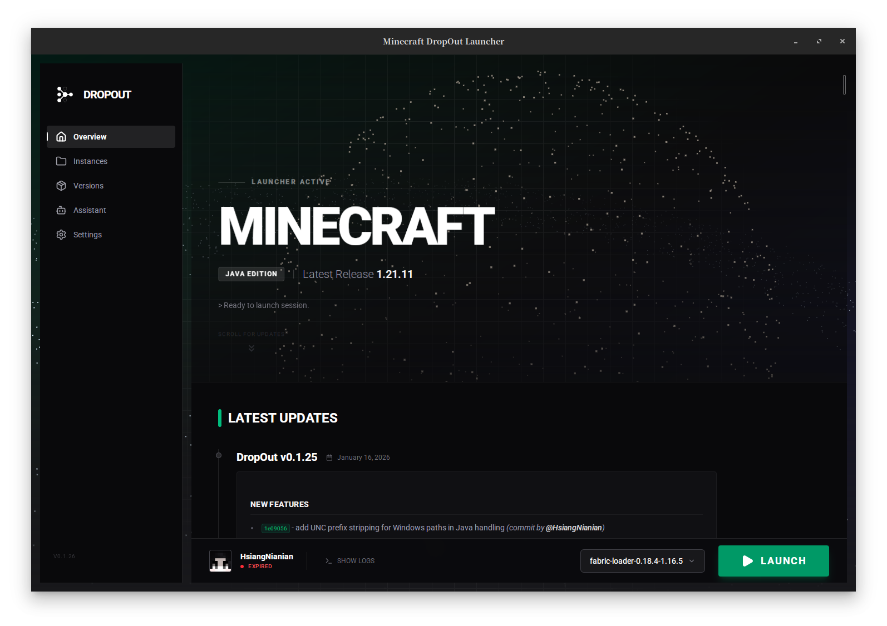

<p align="center">
  
</p>

<h1 align="center">DropOut</h1>

<p align="center">
  <em>A deterministic Minecraft launcher for reproducible, inspectable game environments.</em>
</p>

<p align="center">
  <a href="https://github.com/HydroRoll-Team/DropOut"></a>
  <a href="LICENSE"></a>
  <a href="https://github.com/HydroRoll-Team/DropOut/releases"></a>
  <a href="https://github.com/HydroRoll-Team/DropOut/actions/workflows/test.yml"></a>
  <a href="https://github.com/HydroRoll-Team/DropOut/actions/workflows/codeql.yml"></a>
  <a href="https://github.com/HydroRoll-Team/DropOut/actions/workflows/semifold-ci.yaml"></a>
  <br>
  
  
  
  
  
  
</p>

<p align="center">
  <b>English</b> | <a href="README.CN.md">Chinese</a>
</p>

---

## What Is This

**DropOut** is a modern, developer-grade Minecraft launcher built around one idea: a game setup should be traceable like a software project.

Most launchers focus on starting the game. DropOut also keeps the surrounding environment understandable: account state, Java runtime, game version, loader, instance directory, assets, libraries, and launch logs.

> Minecraft environments are complex systems. DropOut treats them as versioned workspaces.

---

## Project Shape

DropOut is a desktop application with three active surfaces:

| Surface | Path | Stack | Purpose |
|---|---|---|---|
| Desktop shell | `src-tauri/` | Rust, Tauri 2 | Authentication, downloads, Java/version resolution, instance storage, launch orchestration |
| Launcher UI | `packages/ui/` | React 19, shadcn/ui, Vite/Rolldown, Tailwind CSS 4 | Main application interface rendered inside the Tauri webview |
| Documentation | `packages/docs/` | Fumadocs, React 19, React Router 7 | Bilingual product and developer documentation |

The Rust core owns side effects. The React UI invokes Tauri commands and renders state. The docs package explains the product, architecture, and user workflows.

---

## Features

- **Microsoft authentication** - device-code OAuth flow, Minecraft Services login, token refresh, and persisted account state.
- **Offline accounts** - local accounts for testing or non-network play.
- **Launch command center** - one state-driven action for sign-in, repair, download, launch, stop, and failure recovery, backed by real readiness checks.
- **Instance library** - searchable and sortable grid/list views, progressive readiness, active-instance details, and guarded management actions.
- **Instance system** - isolated game directories with per-instance notes, memory and Java overrides, version, loader, mods, saves, and migration entry points.
- **Minecraft version management** - install, verify, list, delete, and launch local versions.
- **Fabric and Forge support** - loader version discovery plus installer flows for modded instances.
- **Java management** - local Java detection, compatibility checks, Adoptium catalog lookup, downloads, resume, and cancellation.
- **Concurrent downloads** - asset/library queues with progress events and recovery paths.
- **Configuration editor** - edit launcher JSON with locally bundled Monaco, schema diagnostics, formatting, keyboard save, and discard protection.
- **Release feed** - GitHub release notes surfaced on the home screen.
- **Game assistant** - optional local or OpenAI-compatible helper for logs, crashes, and configuration questions.

---

## Quick Start

### Prerequisites

- Rust toolchain from [rustup.rs](https://rustup.rs/)
- Node.js 22+
- pnpm 10+
- OS dependencies from the [Tauri v2 prerequisites](https://v2.tauri.app/start/prerequisites/)

### Install Dependencies

This repository does not use `pnpm-workspace.yaml`. Install each JavaScript surface against the root lockfile:

```bash
pnpm install
pnpm -C packages/ui --lockfile-dir "$PWD" install
pnpm -C packages/docs --lockfile-dir "$PWD" install
```

`pnpm install` also runs the repository `prepare` script, which installs the local `prek` hooks.

### Run The Desktop App

```bash
pnpm exec tauri dev
```

Tauri starts the React UI dev server through `src-tauri/tauri.conf.json` and opens the desktop window at `http://localhost:1420`.

### Build A Desktop Release

```bash
pnpm exec tauri build
```

Release artifacts are produced by Tauri under the Rust target directory and configured bundle directories.

### Run Package Surfaces Directly

```bash
pnpm -C packages/ui dev
pnpm -C packages/docs dev
```

The UI can run in a browser for layout work, but Tauri-backed flows require the desktop shell.
For repeatable browser-only UI work, use the development fixtures and Playwright workflow documented in [packages/ui/README.md](packages/ui/README.md).

---

## Common Commands

| Task | Command |
|---|---|
| Install root tooling | `pnpm install` |
| Install UI dependencies | `pnpm -C packages/ui --lockfile-dir "$PWD" install` |
| Install docs dependencies | `pnpm -C packages/docs --lockfile-dir "$PWD" install` |
| Run desktop app | `pnpm exec tauri dev` |
| Build desktop app | `pnpm exec tauri build` |
| Run UI dev server | `pnpm -C packages/ui dev` |
| Build UI bundle | `pnpm -C packages/ui build` |
| Lint UI | `pnpm -C packages/ui lint` |
| Test UI fixtures, accessibility, and screenshots | `pnpm -C packages/ui test:ui` |
| Update reviewed UI screenshot baselines | `pnpm -C packages/ui test:ui:update` |
| Run docs site | `pnpm -C packages/docs dev` |
| Build docs site | `pnpm -C packages/docs build` |
| Check docs types/content | `pnpm -C packages/docs types:check` |
| Validate Cloudflare docs deploy | `pnpm deploy:docs:dry-run` |
| Deploy docs to Cloudflare Workers | `pnpm deploy:docs` |
| Test Rust workspace | `cargo test --workspace` |

Deployment maintenance is documented in [docs/cloudflare-deployment.md](docs/cloudflare-deployment.md).

---

## Repository Layout

```text
.
|-- assets/                 # README and project media
|-- crates/                 # Rust support crates and macros
|-- packages/
|   |-- docs/               # Fumadocs + React Router documentation site
|   `-- ui/                 # React launcher frontend
|-- scripts/                # Release and maintenance scripts
|-- src-tauri/              # Rust desktop backend and Tauri configuration
|-- Cargo.toml              # Rust workspace
|-- package.json            # Root tooling
`-- pnpm-lock.yaml          # Shared pnpm lockfile
```

---

## Architecture Notes

The command boundary is registered in [`src-tauri/src/main.rs`](src-tauri/src/main.rs). Feature modules live under `src-tauri/src/core/`:

- `auth.rs` and `account_storage.rs` handle Microsoft and offline account state.
- `instance.rs` owns isolated instance directories and metadata.
- `game_version.rs`, `manifest.rs`, and `migration.rs` resolve Minecraft versions and launch rules.
- `fabric.rs`, `forge.rs`, `maven.rs`, and `downloader.rs` install loaders, libraries, assets, and version files.
- `java/` detects, validates, and persists compatible Java runtimes.
- `modpack/`, `mods.rs`, and `content_search.rs` handle modpack parsing, mod metadata, and content discovery.
- `assistant.rs` powers the optional troubleshooting assistant.

The UI keeps long-lived state in `packages/ui/src/models/`, renders routes from `packages/ui/src/pages/`, and shares reusable controls from `packages/ui/src/components/`.

---

## Roadmap

- [x] Account persistence and token refresh
- [x] Microsoft device-code login and offline login
- [x] Java auto-detection and Adoptium download flow
- [x] Fabric and Forge install paths
- [x] Isolated instance/profile system
- [x] GitHub releases integration
- [x] Optional game assistant
- [ ] Multi-account switching
- [ ] Built-in mods manager
- [ ] Custom game directory selection
- [ ] Launcher auto-updater
- [x] Basic discovery and copy-based import from PCL, HMCL, MultiMC, and Prism Launcher
- [ ] Migration conflict previews, cancellation, rollback, and structured compatibility reports

The public roadmap is tracked at <https://roadmap.sh/r/minecraft-launcher-dev>.

---

## Contributing

DropOut is built for long-term maintainability. Useful contributions usually improve one of these areas:

- instance and profile workflows
- mod loader compatibility
- Java/runtime detection
- downloader reliability
- UI/UX clarity
- documentation and troubleshooting coverage

Use the standard GitHub flow: fork, branch, commit, and open a pull request against [HydroRoll-Team/DropOut](https://github.com/HydroRoll-Team/DropOut).
UI contributors should also read the [fixture and regression testing guide](packages/ui/README.md).

---

## License

[](LICENSE)

Distributed under the GNU Affero General Public License v3.0. See [LICENSE](LICENSE) for details.
